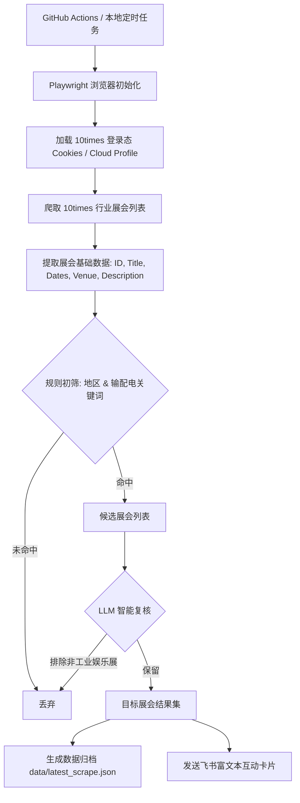

# 10times 电力能源展会雷达 (10times Power-Energy Tradeshow Radar)

本项目是一个专为电力与能源行业（特别是输配电领域）设计的自动化展会信息监控系统。它能够定期爬取 **10times** 展会平台，通过“规则初筛 + 大语言模型（LLM）精准复核”双重过滤机制，自动识别高价值展会，并通过飞书机器人向指定群聊发送结构化、美观的互动卡片通知。

同时，项目深度整合了 GitHub Actions，支持配置持久化登录态与自动化定时运行，是出海企业和行业研究员掌握海外展会动态的得力助手。

---

## 🚀 核心功能

1. **多后端支持的智能爬虫**：
   - 基于 **Playwright**，可配置本地 headed/headless 模式或通过 **Browser Use Cloud** 远程连接云端浏览器。
   - 动态识别并妥善处理 Cloudflare 验证，保障爬取稳定性。
   - 支持从本地或云端 profile 注入/同步 10times 的登录 Cookie，确保持久化登录状态。
2. **“规则 + AI”双重智能过滤**：
   - **规则过滤**：提取展会标题、地点、简介等字段，匹配特定的**目标区域**（南美、澳大利亚、中东、东南亚）和**输配电核心关键词**（变压器、变电站、开关柜、电线电缆、智能电网等）。
   - **AI 精细过滤**：利用大语言模型（OpenAI 兼容接口）对初筛通过的活动进行复核，智能剔除与工业/电力能源无关的展会（如生活娱乐、艺术演出、消费电子等），大幅减少噪声。
3. **飞书交互式卡片推送**：
   - 筛选出的高价值展会以飞书“交互式卡片（Interactive Card）”形式推送至群聊，包含展会名称、时间、地点、分类、AI 过滤依据、简介以及一键查看详情的直达链接。
4. **云端托管与 CI/CD 自动化**：
   - 提供配置完善的 GitHub Actions 流程，支持每周定时运行。支持将数据结果作为 Workflow Artifact 上传保存。

---

## 🛠 核心架构与处理流程



---

## 📋 环境要求与依赖安装

在开始之前，请确保您的系统已安装以下软件：
- **Python 3.11 及以上版本**（请前往 [Python 官网](https://www.python.org/downloads/) 下载适合您系统的安装包）
- **Google Chrome 浏览器**（本地 Headed 运行过 Cloudflare 验证必备，请前往 [Chrome 官网](https://www.google.com/chrome/) 下载）
- **Git**（用于克隆仓库，请前往 [Git 官网](https://git-scm.com/downloads) 下载）

### 1. 克隆项目到本地
```bash
git clone https://github.com/letitbe95/10times-radar.git
cd 10times-radar
```

### 2. 创建并激活虚拟环境
建议使用 Python 虚拟环境隔离依赖：
```bash
python3 -m venv .venv
source .venv/bin/activate  # macOS / Linux
# Windows 环境请使用: .venv\Scripts\activate
```

### 3. 安装依赖包
安装 Python 核心依赖及 browser-use CLI 工具：
```bash
pip install -r requirements.txt
pip install browser-use
```

### 4. 安装 Playwright 浏览器内核
Playwright 首次运行前需要下载浏览器内核及系统级依赖：
```bash
playwright install chromium --with-deps
```

---

## ⚙️ 配置文件说明

项目通过环境变量进行配置。请将项目根目录下的 `.env.example` 文件复制并重命名为 `.env`：
```bash
cp .env.example .env
```
然后根据以下表格配置其中的参数：

| 变量名 | 是否必填 | 默认值 | 说明 |
| :--- | :--- | :--- | :--- |
| `FEISHU_WEBHOOK_URL` | **是** | - | 飞书群自定义机器人的 Webhook 链接 |
| `LLM_API_KEY` | 否 | - | OpenAI 兼容接口的 API Key（用于 AI 精筛，不填则跳过 AI 精筛） |
| `LLM_BASE_URL` | 否 | `https://api.openai.com/v1` | OpenAI 兼容接口的 Base URL |
| `LLM_MODEL` | 否 | - | 使用的语言模型名称（如 `gpt-4o-mini`，`deepseek-chat` 等） |
| `LISTING_URL` | 否 | `https://10times.com/zh-CN/power-energy/tradeshows` | 要爬取的 10times 展会列表页面 URL |
| `MAX_PAGES` | 否 | `0` | 最大爬取页数。`0` 表示全量爬取（约500页），限制为正整数（如 `30`）可用于快速测试或限制消耗 |
| `STATE_PATH` | 否 | `data/seen_events.json` | 历史已爬取展会的记录路径（用于增量过滤） |
| `CRAWLER_BACKEND` | 否 | `auto` | 爬虫后端，可选 `crawl4ai` \| `browser-use` \| `auto` |
| `BROWSER_HEADLESS` | 否 | `false` | 是否使用无头模式。在本地运行时**强烈建议设为 `false`**，以便顺利过 Cloudflare 验证 |
| `CF_WAIT_SECONDS` | 否 | `18` | Cloudflare 验证码页面等待秒数（如遇到滑动验证，可在此期间手动滑块） |

### 🔑 登录态与云端运行配置 (GitHub Actions / CI 必须)
由于 10times 对未登录用户有展示限制或防爬策略，在 GitHub Actions (无头/CI) 中运行需要预先获取登录态。项目提供两种登录态维持方案（二选一）：

#### 方案 A：Cloud Profile 同步（推荐，适合 browser-use cloud 用户）
1. 在本地配置好 `browser-use` API 密钥：
   ```bash
   browser-use config set api_key "您的_BROWSER_USE_API_KEY"
   ```
2. 连接一次云端以初始化 Cloud Profile ID：
   ```bash
   browser-use cloud connect
   ```
   该命令会在终端输出 `cloud_connect_profile_id` 并保存在 `~/.browser-use/config.json` 中。
3. 运行本地同步脚本，它会启动浏览器引导您在 10times 进行登录，并将本地的浏览器 Profile 上传到云端：
   ```bash
   export BROWSER_USE_API_KEY="您的_BROWSER_USE_API_KEY"
   python3 scripts/sync_cloud_profile.py
   ```
4. 将得到的 `BROWSER_USE_API_KEY` 和 `BROWSER_USE_CLOUD_PROFILE_ID` 填入 `.env` 或 GitHub Secrets。

#### 方案 B：本地 Cookie 导出与 Base64 注入（备选）
1. 运行本地 Cookie 导出脚本（会自动调起浏览器）：
   ```bash
   python3 scripts/export_10times_cookies.py --b64
   ```
2. 浏览器打开后，请手动完成 10times 的登录，登录成功后关闭浏览器或等待脚本完成。
3. 脚本会在本地 `data/10times_cookies.json` 保存 Cookie，并在终端输出 Base64 编码的字符串。
4. 将该 Base64 字符串填入 `.env` 的 `TENTIMES_COOKIES_B64` 或 GitHub Secrets `TENTIMES_COOKIES_B64` 中。

---

## 🏃 使用指南

### 1. 本地运行
配置好 `.env` 之后，在激活的虚拟环境中直接执行以下命令：
```bash
python3 scripts/crawl_events.py
```
**常用命令行参数**：
- `--no-llm`: 跳过大语言模型精筛，仅使用规则初筛（适用于未配置 LLM API Key 的情况）。
- `--max-pages 5`: 覆盖环境变量中的 `MAX_PAGES`，限制只爬取前 5 页（极速调试）。
- `--artifact data/test.json`: 指定爬取结果 JSON 文件的保存路径。

### 2. GitHub Actions 自动运行
项目在 `.github/workflows/scrape.yml` 中配置了 GitHub Actions。
- **定时触发**：默认在每周一凌晨 1:00 (UTC) 定时自动触发。
- **手动触发**：支持在 GitHub 仓库的 Actions 页面选择 `10times Radar` 并点击 `Run workflow` 手动运行。
- **Secret 配置**：在 GitHub 仓库中，依次点击 `Settings -> Secrets and variables -> Actions`，添加以下 **Repository secrets**：
  - `FEISHU_WEBHOOK_URL` (必填)
  - `LLM_API_KEY`, `LLM_BASE_URL`, `LLM_MODEL` (选填)
  - `BROWSER_USE_API_KEY`, `BROWSER_USE_CLOUD_PROFILE_ID` (方案 A 选填)
  - `TENTIMES_COOKIES_B64` (方案 B 选填)

---

## 📁 目录结构说明

```text
10times-radar/
├── .github/
│   └── workflows/
│       └── scrape.yml            # GitHub Actions 自动化工作流定义
├── data/
│   ├── seen_events.json         # 历史已筛选展会 ID (去重，增量更新)
│   └── latest_scrape.json       # 每次运行产生的最新爬取详细结果 (不提交 Git)
├── scripts/
│   ├── crawl_events.py          # 主入口：执行页面爬取、初筛、精筛并推送飞书
│   ├── export_10times_cookies.py# 工具：导出本地浏览器 10times 登录态 Cookie
│   ├── sync_cloud_profile.py    # 工具：同步本地 10times 登录态到 Browser Use 云端 Profile
│   └── lib/
│       ├── browser.py           # 浏览器自动化封装 (基于 Playwright / Browser Use)
│       ├── config.py            # 环境变量与配置项加载
│       ├── feishu.py            # 飞书群自定义机器人交互式卡片渲染与发送
│       ├── filter_events.py     # 展会初筛与 AI 精选核心过滤算法
│       └── models.py            # 展会数据模型 (Dataclass)
├── requirements.txt             # Python 项目核心依赖声明
└── README.md                    # 项目文档
```

---

## 📜 许可证

本项目采用 [MIT License](https://opensource.org/licenses/MIT) 许可。
